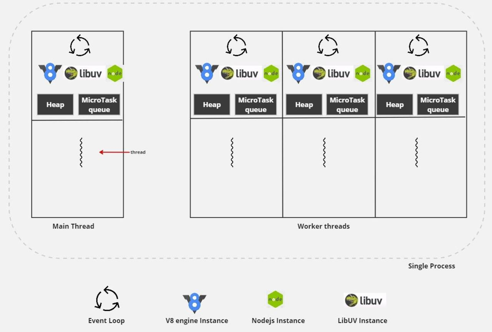

# Worker Threads в Node.js

## 1. Полноценная многопоточность в Node.js и отличие от Thread Pool libuv

В стандартной среде Node.js код выполняется в **одном потоке** (single-threaded), но благодаря **Worker Threads** можно создавать **настоящие многопоточные вычисления**.

### **Thread Pool в libuv**

`worker_threads` появились в Node.js как дополнение к **Thread Pool в libuv**, который продолжает использоваться для асинхронных операций, таких как:

- Чтение и запись файлов (`fs`)
- Криптографические операции (`crypto`)
- DNS-запросы (`dns.lookup`)
- Сжатие данных (`zlib`)

Thread Pool — это **пул потоков**, в котором Node.js управляет задачами, **но код на JavaScript всё равно выполняется в одном потоке**. Например, вызовы `fs.readFile` используют поток из **Thread Pool**, но сам JavaScript продолжает работать в основном потоке.

### Worker Threads: настоящая многопоточность

В отличие от Thread Pool, **Worker Threads создают полноценные потоки ОС**, где каждый поток:

- **Запускает свой отдельный движок V8**
- **Исполняет JavaScript независимо от главного потока**
- **Создаёт собственный экземпляр libuv со своим Thread Pool и Event Loop**



Это делает `worker_threads` **незаменимыми** для **CPU-интенсивных вычислений** (например, вычисление факториала, рендеринг изображений, машинное обучение и т.д.).

---

## 2. Передача данных между Worker’ами

Worker Threads могут обмениваться данными через:

- `postMessage()` – передача данных (обычно сериализуемых, как JSON)
- `SharedArrayBuffer` – общий буфер памяти между потоками
- `MessageChannel` – канал для двухстороннего общения

### Простой пример передачи данных

#### В главном потоке (`main.ts`):

```typescript
const worker = new Worker('./worker.js');
worker.postMessage('Привет, Worker!');
worker.on('message', (msg) => {
  console.log('Ответ от Worker:', msg);
});
```

#### В Worker (`worker.js`):

```typescript
const { parentPort } = require('worker_threads');
parentPort.on('message', (data) => {
  console.log('Worker получил:', data);
  parentPort.postMessage('Привет, главный поток!');
});
```

---

## 3. Пример многопоточного вычисления факториала

📌 **Пример многопоточного запуска вычисления факториала:**
[Смотреть `main.ts`](./main.ts)

В этом примере:

- Число **разбивается на части (chunk'и)**
- Запускаются **несколько Worker’ов**, каждый считает свой кусок
- Итоговые результаты передаются **в финальный Worker**, который перемножает результаты

### **Структура проекта:**

```
├── factorial.ts   # Воркеры считают части факториала
├── helpers.ts     # Вспомогательные функции
├── main.ts       # Запуск всех воркеров
└── sum.ts        # Итоговое перемножение
```

Этот подход позволяет **распараллелить** сложные вычисления и максимально задействовать мощность процессора.

---

## Вывод

- **Thread Pool в libuv** хорош для **I/O-операций**, но **не умеет выполнять JavaScript в отдельных потоках**.
- **Worker Threads** позволяют **исполнять код параллельно**, что делает их идеальными для **CPU-интенсивных задач**.
- **Передача данных между Worker’ами** возможна через `postMessage()`, `SharedArrayBuffer` и `MessageChannel`.
- **Пример с факториалом** показывает, как **эффективно использовать Worker Threads** для многопоточных вычислений в Node.js.
